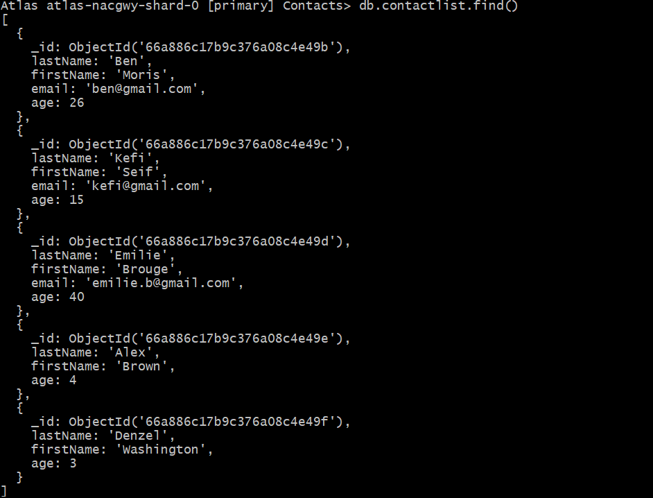
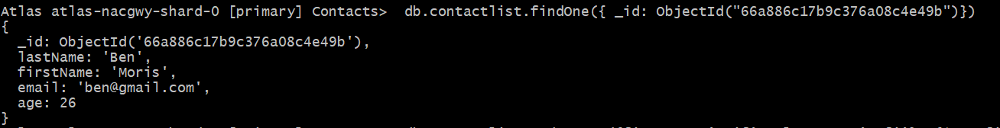
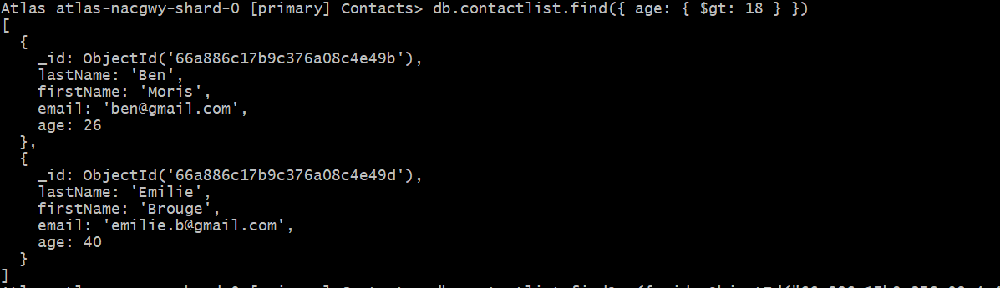
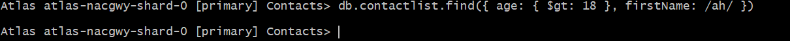
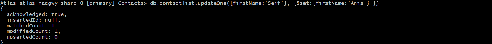
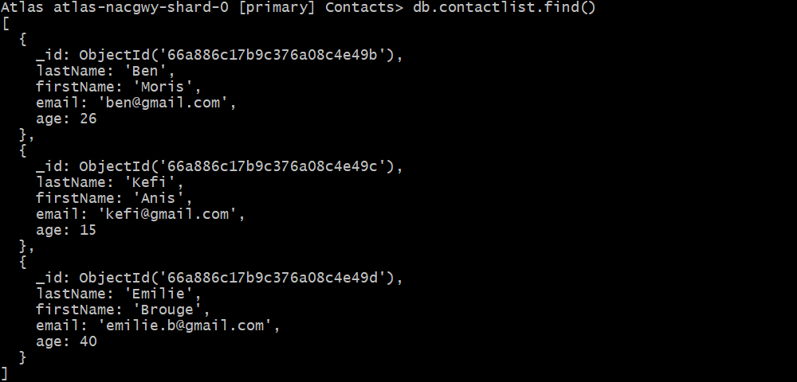

# The main idea is to manipulate MongoDB CRUD operations

1. Display all of the contacts list.
   

2. Display all the information about only one person using his ID.
   
3. Display all the contacts with an age >18.
   
4. Display all the contacts with an age>18 and name containing "ah".
   
5. Change the contact's first name from"Kefi Seif" to "Kefi Anis".
   
6. Delete the contacts that are aged under <5.
   
7. Display all of the contacts list.
   
